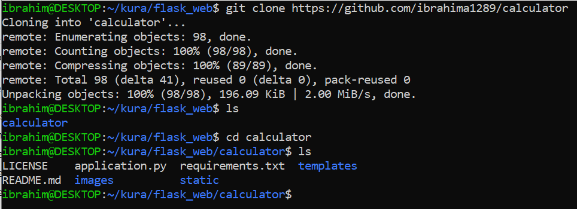
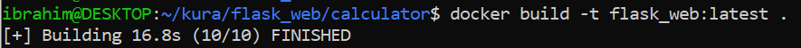
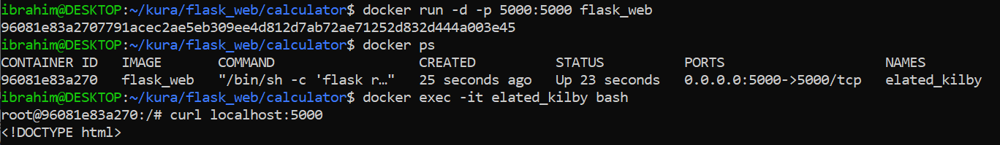
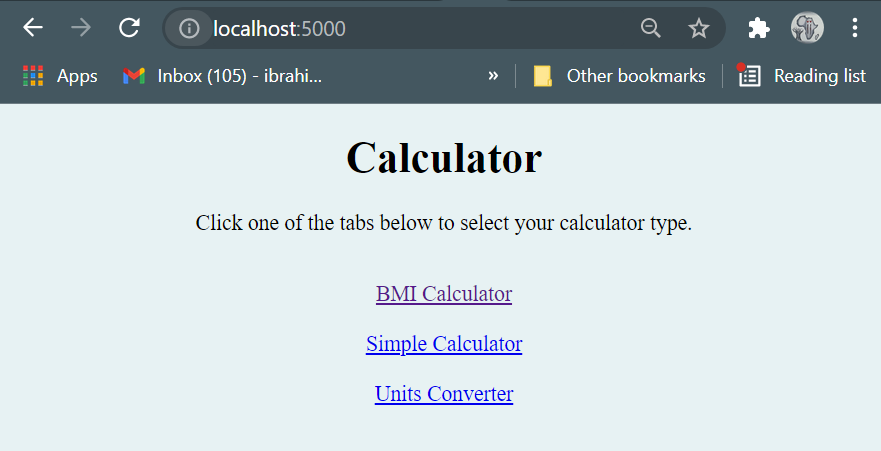
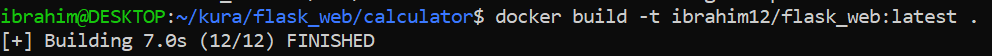
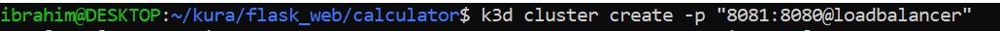
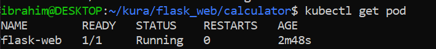
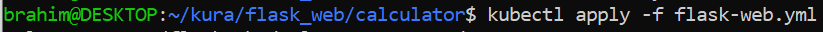
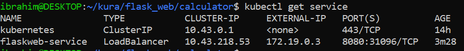

# K8s assignment

### For this assignment, we used a Python Flask app called [calculator](https://github.com/ibrahima1289/calculator) to deploy.

## Goal

**Task 1**: Dockerize a flask app and create an image you can push up to DockerHub.
 
**Task 2**: Deploy the Flask app in Kubernetes.

 * Create a cluster with a Load Balancer.
 * Create a deployment yaml file for the flask app.

**Task 3**: Document your process of Dockerizing your flask app and deploying your app to Kubernetes.

## Precedure

### Task 1: Dockerize your flask app and create an image you can push up to DockerHub.

1. Creat a folder `kura > flsk_web`

2. Used git to clone app files
  ```
  $ git clone https://github.com/ibrahima1289/calculator
  ```
  
  
  
3. Deleted files: README.md, LICENSE, and Pictures

4. Update the python code
  ```
  $ nano application.py
  ```
5. Updated the code : add host in the code below
  ```
  if __name == '__main__':
      app.run(debug=True, host='0.0.0.0')
  ```
    Now, click on `ctrl + o` to write, edit the name of the file as `application.py`, then `ctrl + x` to exit.
    
6. Make sure the requirements are updated
  ```
  $ cat requirements.txt
  ```
7. Install flask
  ```
  $ pip install flask
  ```
8. Create a Dockerfile
  ```
  $ nano Dockerfile
  ```
  Then, copy the code below:
  ```
  FROM python:3.10
  COPY ./requirements.txt requirements.txt
  RUN pip install -r requirements.txt
  COPY application.py application.py
  COPY static/ /static/
  COPY templates/ /templates/
  ENV FLASK_APP=application.py
  EXPOSE 5000
  CMD flask run --host=0.0.0.0
  ```
  Finally, click on `ctrl + x` to exit.

9. Build the image
  ```
  $ docker build -t flask_web:latest .
  ```
Note: The period at the end of the command: it will run the Dockerfile located in the current directory you are in. If the Dockerfile is in a different directory, provide the path to that directory.



10. Run the container
  ```
  $ docker run -d -p 5000:5000 flask_web
  ```
11. Display the images in order to find the name of the image to `exec`.
  ```
  $ docker ps
  $ docker exec -it elated_kilby bash
  ```
Now you are in the container, run the curl command to test the application
```
root@96081e83a270:/# curl localhost:5000
```


To check if it is running, open a web browser and type `localhost:5000` then hit enter.
It should be successful.




### Task 2: Deploy your Flask app in Kubernetes.

1. Now, recreate the previous image and tag it 
```
$ docker build -t ibrahim12/flask_web:latest .
```



2. Push it to dockerhub
```
$ docker push ibrahim12/flask_web:latest
```


3. Create your cluster with a Load Balancer
```
$ k3d cluster create -p “8081:8080@loadbalancer”
```



4. Create a pod
```
$ kubectl run --image ibrahim12/flask_web -it flask-web
```


5. Check the status of the pod




6. Create a deployment yaml file for your flask app.
```
$ nano flask-web.yml
```


Then copy the code below to the yaml file

```
apiVersion: apps/v1
kind: Deployment
metadata:
  name: flask-web-deployment
spec:
  selector:
    matchLabels:
      app: flask_web
  replicas: 1 # tells deployment to run 1 pods matching the template
  template: # create pods using pod definition in this template
    metadata:
      labels:
        app: flask_web
    spec:
      containers:
      - name: flask-web-container
        image: ibrahim12/flask-web:latest
        ports:
        - containerPort: 5000
---
apiVersion: v1
kind: Service
metadata:
  name: flask-web-service
spec:
  type: LoadBalancer
  ports:
  - port: 8080
    protocol: TCP
    targetPort: 5000
  selector:
    app: flask_web
```

7. Run the `yml` file
```
$ kubectl apply -f flask-web.yml
```



8. Check the services



9.  Check on the web browser
```
http://localhost:8080
```

10. Delete the deployment and service after you finish.
```
kubectl delete pods,services,deployment -l name=app_name
```


## Sources visited:

1. https://www.joyent.com/blog/dockerizing-a-simple-app<br>
2. https://kubernetes.io/docs/reference/kubectl/cheatsheet/<br>
3. https://runnable.com/docker/python/dockerize-your-flask-application<br>
4. https://kubernetes.io/docs/concepts/workloads/controllers/deployment/<br>

